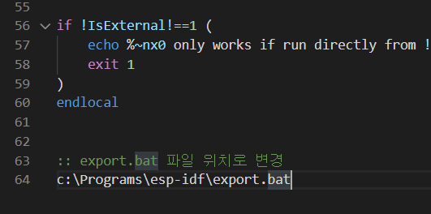
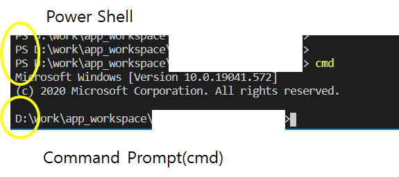
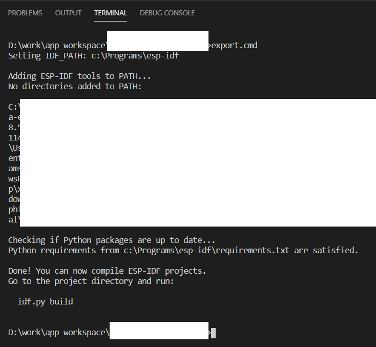

# 윈도우 ESP32 IDF용 스크립트 파일 

파일 설명 

    export.cmd  < 빌드 환경 세팅
    build.cmd   < 빌드
    flash.cmd   < 업로드
    monitor.cmd < 시리얼 모니터

위 파일들을 자신의 프로젝트로 복사해 사용한다.

  

## 1. ESP32 IDF 설치
참고 https://docs.espressif.com/projects/esp-idf/en/latest/esp32/get-started/index.html

  

## 2. export.cmd의 IDF SDK 위치 수정 

export.cmd 파일을 열어 가장 아래에 있는 IDF 위치한 export.bat로 변경

  

## 3. 파워쉘열어 명령어 프롬프트 실행

    PS D:\esp\project > cmd  # < run command prompt
    D:\esp\project >         # < 

  

## 4. 개발 환경 설정

        D:\esp\prject > export.cmd

여기서 부터 idf.py를 바로 사용이 가능함 

즉, idf.py menuconfig 사용 가능

  

## 5. 빌드

        D:\esp\prject > build.cmd

  

## 6. 업로드

        D:\esp\prject > flash.cmd [option port number]
        ex> D:\esp\prject > flash.cmd # < upload (when there is only one port)
        ex> D:\esp\prject > flash.cmd 4 # < upload with com4 

  

## 7. 모니터링

        D:\esp\prject > monitor.cmd [option port number]
        ex> D:\esp\prject > monitor.cmd # < run monitor (when there is only one port)
        ex> D:\esp\prject > monitor.cmd 4 # < run monitor with com4 

